# CLARITY-LLM: Political Evasion Detection with Mistral-7b & QLoRA
_A full-stack ML system for the [SemEval 2026 CLARITY Task](https://konstantinosftw.github.io/CLARITY-SemEval-2026/)_


## Overview
Political communication is often intentionally ambiguous. In high‑stakes settings such as 
presidential interviews and debates, politicians frequently use evasive strategies that obscure 
whether they actually answered the question. While this phenomenon—known as equivocation or evasion—is
well‑studied in political science, it has received limited attention in computational linguistics.

The SemEval 2026 CLARITY shared task addresses this gap by challenging participants to automatically 
classify the clarity of responses in question–answer (QA) pairs extracted from presidential interviews. 
The task is grounded in the taxonomy introduced by Thomas et al. (2024), presented at EMNLP 2024, which proposes
a two‑level hierarchy:

### Level 1 - Clarity Classification
Classify an answer as:
- Clear Reply
- Ambiguous
- Clear Non‑Reply

### Level 2 - Evasion Technique Classification
Classify an answer into one of 9 fine‑grained evasion strategies, capturing the rhetorical tools politicians 
use to avoid giving a direct answer.

This hierarchical framing enables deeper discourse analysis and has been shown to improve classification performance
when both levels are modeled jointly.

## System Architecture
This project implements a full-stack pipeline designed for low-latency inference on consumer hardware. The system orchestrates a Next.js frontend, a FastAPI inference server, and an optimized Mistral-7B model using Docker Compose.

```mermaid
graph LR
    %% Define Nodes inside Subgraphs
    subgraph User_Layer [User Interaction]
        direction TB
        U([User])
    end

    subgraph Docker_Eco [Docker Compose Ecosystem]
        direction TB
        
        subgraph FE [Frontend Container]
            Next[Next.js UI]
        end

        subgraph BE [Backend Container]
            API[FastAPI Server]
            Logic[Preprocessing & Prompting]
        end

        subgraph Model_Engine [Inference Engine]
            Unsloth[Unsloth Library]
            Mistral[Mistral-7B-Instruct]
            LoRA[LoRA Adapters]
        end
    end

    %% Data Flow Connections
    U -->|Input QA Pair| Next
    Next -->|REST API Request| API
    API -->|Raw Text| Logic
    Logic -->|Formatted Prompt| Unsloth
    Unsloth -->|Accelerated Inference| Mistral
    Mistral -.->|Active Adapter| LoRA
    Mistral -->|Prediction| API
    API -->|JSON Response| Next
    Next -->|Display Result| U

    %% Styling (Applied at the end to prevent errors)
    classDef container fill:#e1f5fe,stroke:#01579b,stroke-width:2px,color:#000;
    classDef model fill:#fff3e0,stroke:#e65100,stroke-width:2px,color:#000;
    classDef user fill:#f3e5f5,stroke:#4a148c,stroke-width:2px,color:#000;

    class U user;
    class Next,API,Logic container;
    class Unsloth,Mistral,LoRA model;
```



## Model & Optimization

- **Base model:** Mistral-7b-instruct (4bit)
- **Fine‑tuning**: LoRA (4‑bit quantization)
- **Library**: Unsloth
- **Training**: 3 epochs
- **Hardware‑efficient**: QLoRA + 4‑bit quantization

Why Mistral-7B-Instruct?
Mistral-7B-Instruct-v0.3 was selected as the foundational model for three key reasons:
1. Hierarchical Schema Alignment: The CLARITY task demands strict adherence to a two-level taxonomy (ambiguity detection $\rightarrow$ 9 distinct evasion strategies).
  Mistral-7B-Instruct demonstrates superior capability in mapping complex rhetorical nuances to specific class labels and at the same time it is optimized to strictly respect system prompts.
2. Long-Context Handling: Political interviews often involve long-winded answers where the "evasion" happens in subtle spots. Mistral's Sliding Window Attention (SWA)
   mechanism allows it to maintain coherence over these longer sequences and focus on local context, crucial for text classification.
3. Efficiency: Mistral-7B offers reasoning capabilities often found in 30B+ parameter models, allowing us to keep
  the system responsive and deployable on single-GPU consumer hardware. Furthermore, the SWA reduces computational complexity on inference.


## Code structure
```
src/
│── models.py        # Model loading, LoRA integration
│── dataset.py       # Dataset preprocessing & loaders
│── evaluate.py      # Evaluation pipeline
│── predict.py       # Inference utilities
main.py              # CLI for train/eval/predict
models/
│── base/            # Cached pretrained model
│── lora/            # Fine‑tuned LoRA adapters
deploy/
│── Dockerfile       # Training/inference image
```

## Methodology
To determine the optimal fine-tuning strategy, an ablation study was conducted on a balanced 10% subset of the training data. Four prompting paradigms: **Default**, **Persona** (Role-playing), **Chain-of-Thought (CoT)**, and **Definition-Aware** were evaluated.

### Key Findings
Experiments revealed that different levels of discourse analysis require different inductive biases:

1.  **Task 1 (Clarity): Reasoning is Key.**
    * **Winner:** Chain-of-Thought (CoT)
    * **Insight:** Determining whether an answer is "ambiguous" requires logical inference. CoT allowed the model to generate intermediate reasoning steps, significantly outperforming standard prompting.

2.  **Task 2 (Evasion): Definitions are Key.**
    * **Winner:** Definition-Aware
    * **Insight:** The 9 evasion strategies (e.g., "Prophylactic," "Polite Correction") are subtle academic constructs. The model performed best when explicitly grounded in the definitions of these classes during training, rather than relying on internal parametric knowledge.

### Impact of Fine-Tuning
Applying these optimized strategies to the full dataset yielded massive performance gains over the base model baseline:

| Task | Base Model F1 | Fine-Tuned F1 | Improvement |
| :--- | :--- | :--- | :--- |
| **Clarity** | 0.0883 | **0.5187** | **+487%** |
| **Evasion** | 0.1275 | **0.3504** | **+174%** |

These results reflect the difficulty of the task—fine‑grained evasion detection is significantly more challenging due to subtle rhetorical cues and class imbalance.

*Full experimental logs and ablation tables can be found in [experiments/Results.md](experiments/Results.md).*


## Full-stack Deployment
### Backend - FastAPI
- Loads the fine‑tuned model (base + LoRA or merged)
- Exposes REST endpoints for clarity and evasion predictions
- Handles preprocessing, inference, and post‑processing
- Designed for low‑latency, GPU‑accelerated serving

### Frontend - React / Next.js
- Clean UI for entering QA pairs
- Displays clarity and evasion technique prediction labels
- Communicates with the FastAPI backend via REST

### Containerization
Each component has its own Dockerfile:
- **deploy/Dockerfile** — training & CLI
- **deploy/Dockerfile.api** — FastAPI inference server
- **deploy/Dockerfile.frontend** — Next.js build

A top‑level docker-compose.yml orchestrates:
- API service
- Frontend service
- (Optional) training/inference service

This enables one‑command deployment of the entire system.

## How to run
### Local setup
If you want to run training/evaluation scripts locally:
```bash
git clone https://github.com/ostriftis/clarity-app.git
cd clarity-app

python3 -m venv venv ## conda environments are also suggested 
source venv/bin/activate

pip install --upgrade pip
# setup.sh needs execution rights
./setup.sh
```
### CLI commands examples:
```python
python main.py train --task clarity --technique chain_of_thought --output_dir models/lora
python main.py evaluate --task evasion --model_path models/base --lora_path models/lora
python main.py predict --task clarity --question "..." --answer "..."
```
_See the [CLI Guide](cli-guide.md) for full usage._

### Docker
In order to start all services at the same time:
```bash
docker compose build
docker compose up --build
```

Keep in mind that gpu with at least 6GB VRAM is needed in order to load the model.

Terminate:
```bash
docker compose down
```

### Model Management
The project automatically loads models from:
```
models/base/   # Pretrained model (cached)
models/lora/   # Fine‑tuned LoRA adapters
```


